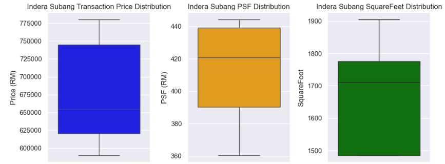
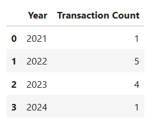
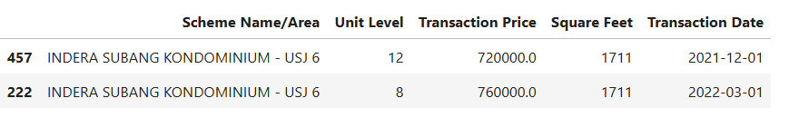

# I Made a Prediction Model to Determine if the Property is Overpriced or Undervalued

## Intro : Property Market in Malaysia

The property market has always been a marker of economic activity and personal investment. In recent years, data-driven tools have become indispensable for assessing property value, enabling buyers and investors to make informed decisions. But how can we use these data to help us determine whether a property is truly **overpriced or undervalued**? 

While Malaysia’s property market has doubled over the past 14 years, the dream of homeownership is slipping out of reach for many, especially younger Malaysians aged 25 to 45. Surveys from [MalayMail](https://www.malaymail.com/news/malaysia/2024/01/19/more-malaysian-millennials-dropping-home-ownership-dreams-as-prices-spiral-out-of-reach/113296) and [Property Guru](https://www.propertyguru.com.my/property-guides/malaysia-consumer-sentiment-study-h2-2023-71197) reveal a growing sentiment of despair among millennials due to soaring property prices.

Therefore, the aim for this analysis is to encourage those who want to purchase property to do their homework and demonstrate how data can help us make better decisions. Property purchase is a serious commitment and should not be done based on feelings. I still remember I almost bought a property just because I was impressed by the sales gallery the first time I visited. I actually placed a booking but ended up canceling it. Otherwise, I would have spent the next 35 years figuring out how to finance a decision made on impulse within one hour.

## How did Malaysians make purchases back then?

Traditionally, property value was assessed through **agent expertise** and basic market comparisons. Over time, the industry adopted valuation models powered by data, enabling deeper insights. Yet, questions remain about their accuracy: Are we accounting for enough variables? What drives these fluctuations?

This project leverages data science techniques to explore these questions, focusing on the Subang Jaya property market. Inspired by personal experiences and market challenges, the aim is to identify actionable insights for buyers and investors.

This post continues the journey of exploring the property market in Subang Jaya, here’s the [prequel](https://medium.com/@kwanqi.yt/real-estate-analysis-with-python-cfe7eb4cbd88).

## How Much Should This Property Worth Given The Square Feet? 
To illustrate, consider a property listed at RM600,000. If similar properties transacted at RM550,000, it raises questions about potential overpricing. To ensure robustness, our analysis considers location, size, and transaction timelines. We will be using Predictive Analytics to help us determine if a property is overpriced or undervalued.

## **Dataset Overview**

For this analysis, we used data from the **National Property Information Centre (NAPIC)**, which provides transactional data for Malaysian properties.

### Key Details:

- **Source:** NAPIC Open Data
- **Coverage:** Transactions from 2021 to mid-2024.
- **Data Points:** Property area, name, transaction date, size (sq. ft.), and transaction price.

### Dataset Limitations

- **Scope:** The dataset covers second-hand property sales and excludes developer-sold properties, which might lead to incomplete market insights.
- **Bias Potential:** The dataset focuses on specific property types and regions, potentially skewing the findings.

While these limitations exist, the analysis provides a robust starting point for evaluating property values in the Subang Jaya area.

## Key Findings & Patterns

We narrowed our focus to Indera Subang Condominium, built in 2014, featuring low-density living with three blocks and 17 floors. Units range from 1,485 to 1,905 sq. ft., and transaction prices vary between RM600,000 and RM800,000.

**Observations and Visual Insights:**

- **Transaction Price**: The average property transaction price is RM 681,000, with a range from RM 590,000 to RM 780,000.
- **Price per Square Foot (PSF)**: The average PSF is RM 411.77, with a variation of ±RM 30.43. The PSF ranges between RM 360.36 and RM 444.18, indicating some consistency in pricing per square foot.
- **Square Footage**: Properties average 1,655 sq. ft., ranging from 1,485 to 1,905 sq. ft.

  ## Box Plot Analysis

  ### Observations and Visual Insights:

1. **Transaction Price:** Data shows a positive skew, indicating most prices cluster closer to the lower quartile, with a few higher-priced outliers.
2. **PSF:** Distribution leans towards the upper quartile, showing a negative skew.
3. **Square Feet:** Most units cluster near the higher quartile, with minimal variability.

These visuals underscore the variability in pricing and size, highlighting the importance of detailed analysis when assessing value.

## **Transaction Count by Year** 

In total, there are 11 transactions done within the span of 3.5 years, where there are only approximately 200 units, which makes the transaction rate approximately 5% over the past 3.5 years, considered low.

# Predictive Analysis: Is the Price Justified?

When purchasing a property, it’s critical to determine if the transaction price aligns with its market value. In this analysis, I use historical transaction data to predict an acceptable price range for a property with 1,711 square feet using a linear regression model.

The question we aim to answer is:

**What is the acceptable price range for a 1,711 square feet property in Indera Subang based on past transactions?**

### Building the Prediction Model

Using historical transaction data, a linear regression model was built to predict transaction prices based on square footage. Linear regression is used here because property prices often scale with size. The model calculates residuals (the difference between actual and predicted prices) to assess accuracy and determine a confidence interval.

### Key Steps:

1. **Residual Standard Deviation**: Measure how much actual prices deviate from predicted prices. Smaller values indicate better predictions.
2. **Confidence Interval**: Calculate a range within which the true price is likely to fall with 90% confidence.
3. **Prediction**: Estimate the price for a property with 1,711 square feet.

[PythonCodePart2](PythonCodePart2.py)

### Results

The model predicts the following price range for a 1,711 square feet property:

- **Predicted Price**: RM 684,121*(This is the model’s best estimate of the property’s value)*
- **90% Confidence Interval**: RM 652,080 — RM 716,161*(This range indicates that there is a 90% probability that the actual property value falls within these bounds)*

In real-estate transactions, pinpointing an exact price can be challenging. The 90% CI offers a more realistic perspective, acknowledging the inherent uncertainty in property valuation. It helps buyers understand the likely range of acceptable prices, empowering them to make informed decisions.

## Comparing Predicted vs. Actual Transactions

or a 1,711 square feet property in Indera Subang, the model estimates that the fair market value lies between **RM 652,080** and **RM 716,161**. Transactions above this range, such as the RM 720,000 and RM 760,000 sales, may indicate a slight overvaluation, possibly due to external factors like demand or buyer preferences.

By leveraging predictive analytics, buyers can make informed decisions, ensuring they are not overpaying for properties. 

# What’s Next?

This analysis demonstrates how data can guide smarter property decisions. Whether you're considering a home or an investment, grounding your decisions in data reduces risks of overpaying or undervaluing potential opportunities.

As we continue this series, the next phase will focus on feature analysis to identify key determinants of property prices. Stay tuned, and feel free to share your thoughts or suggestions below!
