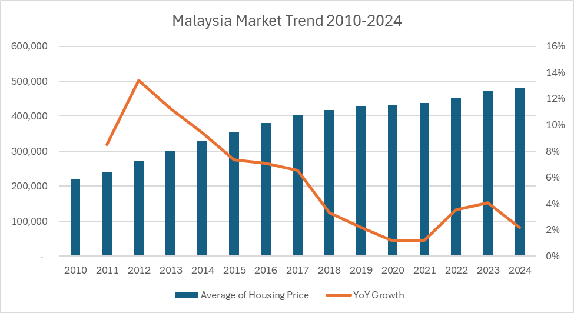
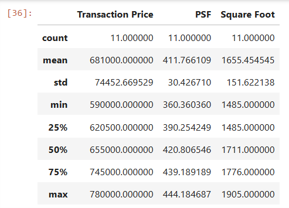

# I Made a Prediction Model to Determine if the Property is Overpriced or Undervalued

## Intro : Property Market in Malaysia

The property market has always been a marker of economic activity and personal investment. In recent years, data-driven tools have become indispensable for assessing property value, enabling buyers and investors to make informed decisions. But how can we use these data to help us determine whether a property is truly **overpriced or undervalued**? 

While Malaysia’s property market has doubled over the past 14 years, the dream of homeownership is slipping out of reach for many, especially younger Malaysians aged 25 to 45. Surveys from [MalayMail](https://www.malaymail.com/news/malaysia/2024/01/19/more-malaysian-millennials-dropping-home-ownership-dreams-as-prices-spiral-out-of-reach/113296) and [Property Guru](https://www.propertyguru.com.my/property-guides/malaysia-consumer-sentiment-study-h2-2023-71197) reveal a growing sentiment of despair among millennials due to soaring property prices.

Therefore, the aim for this analysis is to encourage those who want to purchase property to do their homework and demonstrate how data can help us make better decisions. Property purchase is a serious commitment and should not be done based on feelings. I still remember I almost bought a property just because I was impressed by the sales gallery the first time I visited. I actually placed a booking but ended up canceling it. Otherwise, I would have spent the next 35 years figuring out how to finance a decision made on impulse within one hour.

## How did Malaysians make purchases back then?

Traditionally, property value was assessed through **agent expertise** and basic market comparisons. Over time, the industry adopted valuation models powered by data, enabling deeper insights. Yet, questions remain about their accuracy: Are we accounting for enough variables? What drives these fluctuations?

This project leverages data science techniques to explore these questions, focusing on the Subang Jaya property market. Inspired by personal experiences and market challenges, the aim is to identify actionable insights for buyers and investors.

This post continues the journey of exploring the property market in Subang Jaya, here’s the [prequel](https://medium.com/@kwanqi.yt/real-estate-analysis-with-python-cfe7eb4cbd88).

## How Much Should This Property Worth Given The Square Feet? 
To illustrate, consider a property listed at RM600,000. If similar properties transacted at RM550,000, it raises questions about potential overpricing. To ensure robustness, our analysis considers location, size, and transaction timelines. We will be using Predictive Analytics to help us determine if a property is overpriced or undervalued.

## **Dataset Overview**

For this analysis, we used data from the **National Property Information Centre (NAPIC)**, which provides transactional data for Malaysian properties.

### Key Details:

- **Source:** NAPIC Open Data
- **Coverage:** Transactions from 2021 to mid-2024.
- **Data Points:** Property area, name, transaction date, size (sq. ft.), and transaction price.

### Dataset Limitations

- **Scope:** The dataset covers second-hand property sales and excludes developer-sold properties, which might lead to incomplete market insights.
- **Bias Potential:** The dataset focuses on specific property types and regions, potentially skewing the findings.

While these limitations exist, the analysis provides a robust starting point for evaluating property values in the Subang Jaya area.

## Key Findings & Patterns

We narrowed our focus to Indera Subang Condominium, built in 2014, featuring low-density living with three blocks and 17 floors. Units range from 1,485 to 1,905 sq. ft., and transaction prices vary between RM600,000 and RM800,000.

